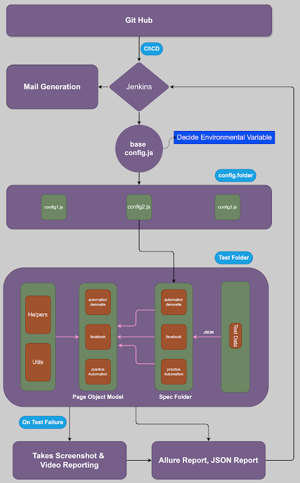

# WebdriverIO - Mocha - Chai Page object model Framework

This project is to create a Page Object Model (POM) framework for UI automation using WebdriverIO, Mocha with Chai assertion library. To follow the coding standards, ESLinter is adapted.

# 

## This Framework Supports
* Multi browser automation
* Modes of run via CLI command
* Headless run
* Allure reports
* Jenkins Integration
* Failed Screenshots
* Grouping the tests
* Parallel Run
* ESLinter adapted
* Video Reports
* JSON Reports
* HTML Reports
* Report Notification - Email
* Logger

### Framework Architecture
# 


## Setup
* 
* Install latest LTS NodeJs version from [https://nodejs.org/](https://nodejs.org/)
* Clone this repository - https://github.com/demo-automation07/webdriverIO
* Navigate to the cloned folder
* Install the dependencies with respect to this project by `npm install `
* Dependencies
     - all dependencies are in [package.json] (package.json) file

## To Run the tests

To run all the tests, one can try
```
npm run wdio
```
This will run all the tests that matches `../test/specs/**/*.js`

### Parallel run
If you have multiple specs to run at a time, one can specify the number of threads that can be open in a single run through,
```
threads=2 npm run wdio
```

### To run in Different Environment
To run the tests in a QA Environment,
```
npm run test:qa
```

To run the tests in a Prod Environment,
```
npm run test:prod
```

### Multi-Browser run
To run the tests in a multiple browsers - Edge, Firefox (All the testcases will be executed),
```
npm run test:crossbrowser
```

### Running specific test
In order to run specific tests,
```
npx wdio ./config/wdio.conf.js --suite TC_smoke
or
npm run test:smoke
``` 
--suite TC_smoke - one can specify the suite name to run specific Test suites.


## Reports
For better illustration on the testcases, allure report has been integrated. Allure reports can also be integrated with jenkins to get a dashboard view. Failed screenshots will be automatically attached to the allure report. Apart from allure, JSON, HTML & Video reports has been integrated. Reports will be generated to the below path (/test/reports) **To Add Test Reports either screenshot or url**

### Allure
To open the allure results,
```
npm run openReport
```
To get this command working, make sure allure commandline is installed in your machine or allure plugin in case of jenkins.

### Video Recording
To enable Video Recording
```
npm run test:allure_videoReport
```

All HTML, JSON reports will be generated by default.

### Logger
Logger file is generated at each Test execution with detail log information. Logs will get attached to the Allure report. To add log in your test methods, Import the logger class and follows,
`logInfo (<log message>, label)`

#### Encrypt a password
Now, to encrypt the password, run 
`npm run encryptPassword (<yourPassword>)`, this will generate the encrypted key. Now store this key in your code which is ready to be checked.

#### Decrypt a password
In the tests, if you need to use the encrypted password, one can directly use `utils.encrypt.decryptPassword (<encryptedKey>)`. This method will decrypt the password and return the original value. If normal string is given then the decryption process won't happen and in that case our tests won't fail since we have not encypted the password.

## Linters
ESLint has been integrated with this project structure. This helps in maintaining common code structure when multiple people involved in working with the same base code. To check the linter errors, one can run `npm run lint`. Unlike linters in other languages ESLint provides an option to fix the errors automatically, this can be invoked by using `npm run lint:fix`.

## Jenkins Integration 
A pipeline has been created and this framework has been integrated with this repo. After each Test execution, an Email Notification along with Test reports are triggered to the Email Recipients.

## Adding page methods to the project

1. Add page specific methods inside the `pages` folder structure. Name the page files with `<spec_name>.pages.js` so that we wont get confused with the file functionality. All the page files extends to the Page class, where we can hold any common methods that are needed across the page files.

```
class HomePage extends actionhelper {
  get btnSkipSignIn() {
    return $('#btn2');
    }
    async clickSkipSignIn() {
        try {
            logInfo('Clicking on the "Skip Sign In" button', 'HomePage');
            await this.clickElement(this.btnSkipSignIn);
        } catch (error) {
            logError('Failed to click the "Skip Sign In" button', 'HomePage');
            throw new Error('Error clicking the "Skip Sign In" button: ' + error.message);
        }
    }
}
```

### Adding locator methods to the project 

1. Add locators inside the page file. For static locator one can use the getter method and declare the values as 

```
get btnSkipSignIn() {
    return $('#btn2');
    }
```

2. For dynamic locator, we need to declare them as a method and call them within the page functions as,

```
// Declare
newWorkspaceTypeToggle(text) {return $('.pm-toggle-switch__item=' + text);}

// Use
this.newWorkspaceTypeToggle(type).click();
```

### Creating a new spec file in the project

Spec files are generally crafted according to our needs, but few of the common practices are,

* Have a global `describe` in your spec file which describes your spec file as a whole.
* Have a sub `describe` to describe your current test case
* Have multiple `it` inside the describe file, this ensures that proper error message is thrown if the tests are failed
* Have all the assetions with custom message, since `expected: true, actual: false` default messages are not much helpful.
* This will ensure that the allure reports as well will have a proper structure.

## Built With

* [WebdriverIO](https://webdriver.io/) - To support browser actions
* [Mocha](https://mochajs.org/) - Core Test Framework
* [Chai](https://www.chaijs.com/) - Assertion Library
* [Allure](https://www.npmjs.com/package/@wdio/allure-reporter) - For Detailed reporting.